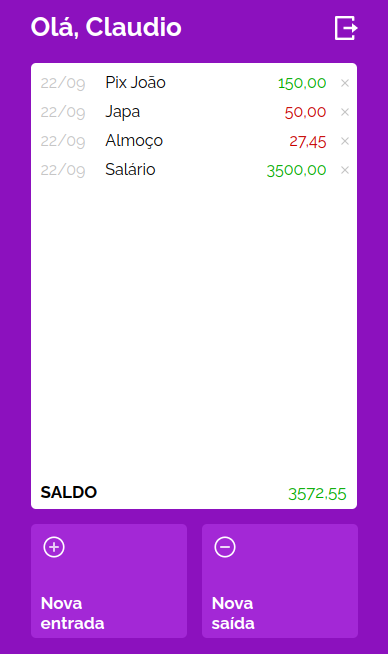

<div align="center">
  <h1>MYWALLET</h1>
  <br>
  - Front-end de um aplicativo web para gerenciamento de finanças pessoais. Esse é um projeto full stack. <a href = "https://github.com/guedesclaudio/my-wallet-api">Respositório do back-end</a>
  <br>
  <br>
  <div align="center">
  <a href="https://my-wallet-taupe.vercel.app/"></a>
  <br>
  <br>
  <p>Clique na imagem para acessar a página</p>
</div>
</div>
<br>
  
# Funcionalidades
- Tela com foco principal para mobile
- Login e cadastro de usuário
- Conexão com a API utilizando axios, e acesso através do token de usuário
- Criação, atualização e exclusão das entradas e saídas
- Persistência dos dados através do local storage

# Tecnologias utilizadas
- HTML5
- CSS3
- JAVASCRIPT
- AXIOS
- STYLED-COMPONENTS
- REACT
- REACT-ROUTER-DOM
- REACT-LOADER-SPINNER
- GIT
- GITHUB
- VSCODE
- LINUX
- VERCEL

# Como rodar
1. Clone esse repositório
2. Instale as dependências:
```bash
npm i
```
3. Rode o projeto:
```bash
npm start
```
4. Para dar build:
```bash
npm run build
```
<br>